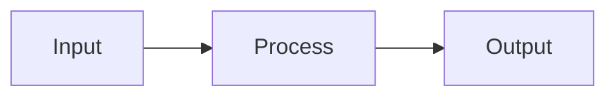

# Shubham Kumar — Portfolio

Static site built with Jekyll, hosted on GitHub Pages. Zero cost, zero sleep, instant loads.

## Adding a blog post

Create a file in `_posts/` named `YYYY-MM-DD-your-title.md`:

```markdown
---
layout: post
title: "Your Post Title"
date: 2025-02-01
tags: [python, ml]
reading_time: 5
excerpt: "One sentence summary shown in listings."
---

Your content here in markdown.
```

Push to main — the site updates in about 60 seconds.

---

## Adding a project

Create a file in `_projects/` named `your-project.md`:

```markdown
---
layout: project
title: "Project Name"
description: "Short description for the listing page."
tech_stack: "Python, FastAPI, PostgreSQL"
featured: true     # shows on homepage
order: 1           # lower = appears first
url_live: "https://yourproject.com"
github: "https://github.com/you/repo"
---

Full markdown description here.
```

---

## Diagrams and interactive elements

### Flowcharts / sequence diagrams (Mermaid)

Write diagrams directly in markdown — no image files needed:

````markdown

````

Supported types: `flowchart`, `sequenceDiagram`, `gantt`, `pie`, `erDiagram`, `gitGraph`

Full syntax: [mermaid.js.org](https://mermaid.js.org/intro/)

### GIFs and images

Drop any image or GIF into `assets/images/` and embed with:

```markdown

```

### Excalidraw diagrams

**Option 1 — Export as SVG** (recommended):
1. Draw in [excalidraw.com](https://excalidraw.com)
2. Export → SVG → save to `assets/images/`
3. Embed: ``

**Option 2 — Live interactive embed**:
1. In Excalidraw, click Share → get a read-only link
2. In your post:

```html
<div class="excalidraw-embed">
  <iframe src="https://excalidraw.com/#json=...your-share-link..."></iframe>
</div>
```

### Code blocks with syntax highlighting

````markdown
```python
def hello(name: str) -> str:
    return f"Hello, {name}!"
```
````

Supported languages: python, javascript, sql, bash, yaml, json, html, css, and many more.

---

## Local development (optional)

You don't need this to publish — just push to GitHub. But if you want to
preview changes before pushing:

```bash
# Install Ruby (use RubyInstaller on Windows: rubyinstaller.org)
gem install bundler
bundle install
bundle exec jekyll serve
# open http://localhost:4000
```

---

## Deployment

Automatic. Every push to `main` triggers the GitHub Action in
`.github/workflows/deploy.yml` which builds and deploys the site.
No commands needed on your end.
