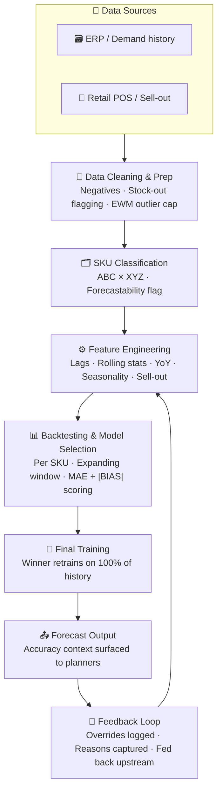
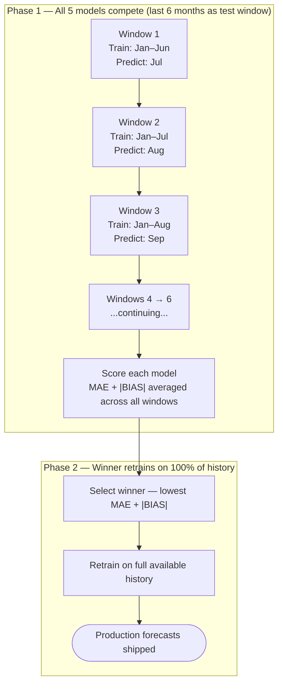

## The problem

We weren't just forecasting demand.

We were trying to forecast demand in a system where:

- Supply constraints distort actual sales — what you sold ≠ what was actually needed
- Data arrives from multiple sources
- Planners don't trust black-box models, and rightfully so
- 50,000+ SKU–location combinations need forecasts every month
- Statistical forecasts were being generated manually, and that was the baseline we had to beat

The real challenge wasn't building a model. It was building a system that produces reliable, explainable, and usable forecasts at scale — one that planners would actually choose to use instead of override.

---

## What makes this problem hard

Standard forecasting projects assume clean, complete data with real demand signals. That's not what production looks like.

**Sales ≠ Demand.** If a product was out of stock for two weeks, your sales data shows zero — but actual demand didn't disappear. A model trained on this data learns the wrong thing. So before touching any model, you have to ask: _what is true demand?_

**Data is noisy and sparse.** Bulk orders, one-time promotions, data entry errors — all of these contaminate the signal. For slow-moving SKUs, there might be 6 months of usable history at best.

**Not all SKUs behave the same.** Treating a stable, high-volume product the same way as an erratic, low-volume one is a recipe for poor performance across the board.

---

## System architecture

Here's how the full pipeline fits together end-to-end. Each stage feeds into the next, and the feedback loop at the bottom is what kept the system improving over time.



---

## Step 1: What is "demand"?

The first engineering challenge was agreeing on what we're even trying to predict.

For most SKUs, we used **historical shipment/sell-in data** after cleaning it for known supply disruptions. But for **AX-classified SKUs** — high-volume, stable products tracked at the retail level — we also had access to **sell-out data** (actual consumer purchases at point of sale), and used that as an additional input feature alongside historical demand.

Why only AX? Sell-out data is cleaner and more representative of true consumer pull, but it's only reliably available for products consistently tracked at retail. For everything else, internal shipment history was the signal.

This distinction matters because sell-out captures demand upstream of inventory distortions. If a product was out of stock at a retailer, internal shipment data shows the reduced orders — but pairing it with sell-out helps the model understand the context: demand was suppressed, not gone.

---

## Step 2: Data cleaning and outlier treatment

Raw demand data is messy. Before any feature engineering or model training, we ran a cleaning pass:

- **Negative values** (data entry errors, returns recorded incorrectly) → set to zero or imputed
- **Implausible spikes** (a one-time bulk order inflating a month by 10×) → treated as outliers
- **Zero demand during known stock-outs** → flagged, not used as a signal for "low demand"

### EWM window capping

The standard approach — capping values at a fixed percentile like the 99th — doesn't work well when demand levels vary enormously across SKUs. A value that's completely normal for a high-volume product might be a massive spike for a slow mover.

Instead, we used **Exponentially Weighted Moving (EWM) statistics** to define a dynamic boundary for each SKU relative to its own recent history. The idea: compute a rolling mean and standard deviation where recent months count more than older ones, then flag anything outside `mean ± N × std` as an outlier and cap it at the boundary.

```python
import pandas as pd
import numpy as np

def cap_outliers_ewm(
    series: pd.Series,
    span: int = 6,
    multiplier: float = 2.5
) -> pd.Series:
    """
    Cap demand outliers using Exponentially Weighted Moving statistics.

    Why EWM instead of a simple rolling window?
    A simple rolling average treats all past months equally. EWM gives
    more weight to recent months. So if demand was 100 last month and
    500 six months ago, the boundary is anchored closer to 100 —
    which is what actually matters for detecting current anomalies.

    Args:
        series:     Raw demand values for a single SKU (sorted by date)
        span:       Controls how fast old values lose influence. span=6
                    gives roughly a 6-month memory — older months fade gradually.
        multiplier: How many std deviations define the outlier boundary.
                    2.5 catches clear spikes without touching normal
                    seasonal variation.
    """
    ewm_mean = series.ewm(span=span, adjust=False).mean()
    ewm_std  = series.ewm(span=span, adjust=False).std()

    upper_cap = ewm_mean + multiplier * ewm_std
    lower_cap = (ewm_mean - multiplier * ewm_std).clip(lower=0)

    return series.clip(lower=lower_cap, upper=upper_cap)


# Apply per SKU-location combination
df['demand_clean'] = (
    df.groupby('sku_site')['demand']
    .transform(cap_outliers_ewm)
)

df['was_capped'] = df['demand'] != df['demand_clean']
print(f"Capped {df['was_capped'].sum()} out of {len(df)} records")
```

This doesn't require manually labelling what's a "real" spike vs. an anomaly. It just constrains each value relative to that SKU's own recent behavior.

---

## Step 3: SKU classification and forecastability

Not every SKU should be modeled the same way, and not every SKU _can_ be forecast well. Before running any models, we classified each SKU across two dimensions.

### ABC — volume-based priority

SKUs ranked by their contribution to total demand:

| Class | Volume share | What it means                                                                  |
| ----- | ------------ | ------------------------------------------------------------------------------ |
| A     | Top ~70%     | Core products. High cost of a bad forecast — stock-outs or overstock at scale. |
| B     | Next ~20%    | Mid-tier. Moderate complexity.                                                 |
| C     | Bottom ~10%  | Slow movers. Often intermittent or erratic demand patterns.                    |

### XYZ — demand stability

SKUs ranked by how stable their demand pattern is, measured by **Coefficient of Variation** (`CV = std / mean`):

| Class | CV        | What it means                                         |
| ----- | --------- | ----------------------------------------------------- |
| X     | < 0.5     | Consistent month-to-month demand. Easier to forecast. |
| Y     | 0.5 – 1.0 | Some volatility or seasonality. Manageable.           |
| Z     | > 1.0     | Erratic and unpredictable. Hard for any model.        |

```python
def classify_xyz(series: pd.Series) -> str:
    mean_demand = series.mean()
    if mean_demand == 0:
        return 'Z'
    cv = series.std() / mean_demand
    if cv < 0.5:
        return 'X'
    elif cv < 1.0:
        return 'Y'
    else:
        return 'Z'

xyz = (
    df.groupby('sku_site')['demand_clean']
    .apply(classify_xyz)
    .reset_index()
)
xyz.columns = ['sku_site', 'xyz_class']
```

Combining the two gives the **ABC–XYZ matrix**. An AX SKU is high-volume and stable — best candidates for ML models and the ones where sell-out data was also available. A CZ SKU is low-volume and erratic — sometimes the most defensible forecast is just a historical average.

### Forecastability flag

Some SKUs aren't worth running ML models on. If a SKU has fewer than 6 months of non-zero demand history, or is purely intermittent (most months are zero), we flag it as low-forecastability and either skip complex models or apply specialized intermittent demand methods.

This step matters for credibility. A model that confidently produces a forecast for a SKU with 2 months of history is generating noise that planners have to manually fix — and that erodes trust in the entire system.

---

## Step 4: The model portfolio

Rather than picking one model for all 50,000+ SKUs, we built a selection framework where different models compete based on backtested performance per SKU. Here's what each model actually does.

### Moving Average

Average the last N months of demand and use that as the forecast. No trend, no seasonality — just smoothed recent history. It sounds too simple, but for stable low-volume SKUs with minimal patterns, it often beats complex models because there isn't enough signal to justify the added complexity.

### Double Exponential Smoothing (Holt's Method)

A step up from moving average. Instead of treating all past months equally, it gives progressively more weight to recent demand and tracks whether demand is trending up or down. Think of it as a moving average that also notices whether you've been consistently selling more or less over time.

### Holt-Winters (Triple Exponential Smoothing)

Extends Holt's method by adding a seasonality component. If a product reliably spikes every Q4 or dips in summer, Holt-Winters learns that repeating annual pattern from history and projects it forward. Works well for products with clear, stable seasonal cycles — falls apart when the seasonality itself is noisy or shifts year over year.

### XGBoost and LightGBM

Gradient boosting models that learn patterns from engineered features (lag demand, rolling averages, month encodings, etc.) rather than a fixed formula. Good at capturing non-linear relationships between inputs and demand.

**XGBoost** is well-tested and robust. **LightGBM** trains significantly faster and scales better across 50,000+ SKUs — which matters in a monthly batch pipeline where training time is a real constraint. Both treat the forecast as a regression problem: given these features about a SKU's history and seasonality, predict next month's demand.

The tradeoff: these models need enough history to learn from. Most useful for mid-to-high volume SKUs (A/B class) with at least 12–18 months of data.

---

## Step 5: Why we stopped using MAPE

Early on, we evaluated models using MAPE (Mean Absolute Percentage Error) because it's the standard metric in most forecasting literature. "We're X% off on average" is easy to explain.

It turned out to be the wrong metric for this problem.

**Problem 1: It breaks when actuals are zero.** MAPE divides by the actual demand value. When actual demand is zero — which happens constantly for slow movers — MAPE is undefined. With 50,000+ SKUs, you either exclude a large number of data points or get `inf` values contaminating your aggregate scores.

**Problem 2: It penalizes over-forecasting more than under-forecasting.** If actual demand is 100 and you forecast 200, MAPE = 100%. If actual demand is 200 and you forecast 100, MAPE = 50%. Same absolute error, very different penalty. This asymmetry causes models optimized for MAPE to drift toward systematic under-forecasting, which leads to stock-outs — exactly the wrong direction for a supply chain system.

### What we used instead

**MAE (Mean Absolute Error)** — simple, interpretable, zero-friendly. "On average, we're off by X units per month per SKU." Same unit as demand, which planners can immediately contextualize.

```
MAE = mean(|actual - forecast|)
```

**BIAS (Forecast Bias)** — tells you whether you're systematically over- or under-forecasting across time. MAE alone doesn't catch this — a model could have acceptable MAE but consistently over-forecast by a small amount every month, leading to gradual inventory bloat.

```
BIAS = mean(forecast - actual)

Positive BIAS → consistently over-forecasting → excess inventory risk
Negative BIAS → consistently under-forecasting → stock-out risk
```

**Combined score: MAE + |BIAS|** — our primary model selection criterion. It penalizes both raw error magnitude and systematic directional drift. A model that's noisy but centered around the truth and a model that's smooth but consistently wrong in one direction both get penalized — which is what you want.

```python
def score_model(actuals: pd.Series, forecasts: pd.Series) -> dict:
    errors = forecasts - actuals
    mae  = errors.abs().mean()
    bias = errors.mean()
    return {
        'MAE':        round(mae, 2),
        'BIAS':       round(bias, 2),
        'MAE+|BIAS|': round(mae + abs(bias), 2)
    }
```

---

## Step 6: Backtesting and model selection

This was the most important engineering decision in the project — not because it's technically complex, but because it's what made planners trust the output.

The core question: for every SKU, which model would have performed best on real historical data? We answer this through **expanding window backtesting** over the last 6 months of available demand history, with each model competing head-to-head.

### How the two phases work



No forecast from Phase 1 ever reaches production. That phase exists only to answer one question: _which model, had it been running live over the past 6 months, would have produced the smallest error on this specific SKU?_ Phase 2 is what actually ships.

### Key design choices

**Expanding window, not rolling.** The training set grows with each step rather than dropping the oldest data. Many SKUs have limited history and we can't afford to discard usable signal.

**Model retrained at every window.** Each evaluation step refits the model on the expanded training set. More compute-intensive, but it ensures the performance estimate reflects how the model actually behaves in monthly production — where it always trains on all available history before forecasting.

**6-month test window.** Long enough to cover seasonal variation in the evaluation period, short enough that we're not sacrificing too much training data on shorter-history products.

**Two-phase approach.** A model selected on the last 6 months and then trained on 100% of history will generally outperform one trained only on a subset. Phase 1 selects; Phase 2 trains.

```python
def backtest_model(model_fn, X: pd.DataFrame, y: pd.Series, n_test: int = 6) -> dict:
    n             = len(y)
    n_train_start = n - n_test
    mae_scores, bias_scores = [], []

    for i in range(n_test):
        train_end = n_train_start + i
        X_train, y_train = X.iloc[:train_end], y.iloc[:train_end]
        X_test,  y_test  = X.iloc[[train_end]], y.iloc[[train_end]]

        model = model_fn(X_train, y_train)   # retrain on expanded window
        pred  = model.predict(X_test)

        error = pred[0] - y_test.values[0]
        mae_scores.append(abs(error))
        bias_scores.append(error)

    mae  = np.mean(mae_scores)
    bias = np.mean(bias_scores)
    return {
        'MAE':        round(mae, 2),
        'BIAS':       round(bias, 2),
        'MAE+|BIAS|': round(mae + abs(bias), 2)
    }


def select_best_model(sku_data, model_registry: dict) -> str:
    X, y   = sku_data['features'], sku_data['target']
    scores = {}
    for name, model_fn in model_registry.items():
        try:
            scores[name] = backtest_model(model_fn, X, y)['MAE+|BIAS|']
        except Exception:
            scores[name] = float('inf')   # skip failed models gracefully
    return min(scores, key=scores.get)
```

---

## Feature engineering

Feature engineering is where most of the actual forecasting work happens — especially for XGBoost and LightGBM, which have no built-in understanding of time. You have to hand them the patterns you want them to learn, expressed as columns in a DataFrame.

Every feature group answers a specific question the model needs to handle well.

### Group 1: Lag features — "What did demand look like recently?"

| Feature  | Offset        | What it captures                                                          |
| -------- | ------------- | ------------------------------------------------------------------------- |
| `lag_1`  | 1 month ago   | Most recent signal. The single strongest predictor for most SKUs.         |
| `lag_3`  | 3 months ago  | Short-term direction — is demand higher or lower than 3 months back?      |
| `lag_6`  | 6 months ago  | Semi-annual patterns. Useful for retail reorder cycles or budget reviews. |
| `lag_12` | 12 months ago | Same month last year. The most important seasonality anchor.              |

```python
for lag in [1, 3, 6, 12]:
    df[f'lag_{lag}'] = df.groupby('sku_site')['demand_clean'].shift(lag)
```

### Group 2: Rolling statistics — "What's the baseline level and how stable is it?"

Lags are noisy — a single unusual month skews them. Rolling statistics smooth over that noise and give the model a sense of the underlying demand level and volatility.

```python
g = df.groupby('sku_site')['demand_clean']

# shift(1) before rolling is critical — see the data leakage note below
df['rolling_mean_3'] = g.transform(lambda x: x.shift(1).rolling(3).mean())
df['rolling_mean_6'] = g.transform(lambda x: x.shift(1).rolling(6).mean())
df['rolling_std_3']  = g.transform(lambda x: x.shift(1).rolling(3).std())

# CV normalizes std by the mean — gives the model a sense of how noisy this SKU is
df['cv_6m'] = g.transform(
    lambda x: x.shift(1).rolling(6).std() / (x.shift(1).rolling(6).mean() + 1e-6)
)
```

`rolling_std_3` is underused in most forecasting writeups. A high rolling std at prediction time is a strong signal that the model's output should be treated with more caution — it also indirectly guides the backtesting framework toward simpler models for erratic SKUs.

### Group 3: Year-over-year — "What was demand doing in this same period last year?"

`lag_12` gives a single point from a year ago. A 3-month rolling mean shifted 12 months back gives a better view of the demand trend in the same period last year.

```python
df['yoy_rolling_mean_3'] = g.transform(lambda x: x.shift(12).rolling(3).mean())

# Is demand this year running above or below the same quarter last year?
df['yoy_ratio'] = df['rolling_mean_3'] / (df['yoy_rolling_mean_3'] + 1e-6)
```

`yoy_ratio` is useful for SKUs with strong seasonality but shifting absolute levels. It tells the model whether demand this year is running 20% above or below the same period prior year — which is more informative than either number in isolation.

### Group 4: Momentum — "Is demand trending up or down recently?"

```python
df['momentum_1_3'] = df['lag_1'] - df['lag_3']
df['momentum_pct'] = df['momentum_1_3'] / (df['lag_3'] + 1e-6)
```

Especially useful for new product ramp-ups and end-of-life SKUs, where the direction of change matters more than the absolute level.

### Group 5: Seasonality encoding — "What time of year is it?"

Tree-based models don't inherently understand that month 12 and month 1 are adjacent. If you pass in raw month numbers (1 through 12), the model treats them as unordered categories or a linear scale — both wrong for cyclical patterns.

The fix is sine/cosine encoding. This maps the 12-month cycle onto a circle so that December and January are geometrically close.

```python
df['month_sin'] = np.sin(2 * np.pi * df['month'] / 12)
df['month_cos'] = np.cos(2 * np.pi * df['month'] / 12)
```

You always need both. With just the sine, March and September look identical. Together, the pair uniquely identifies every month on the cycle.

### Group 6: Supply context — "Was demand suppressed by a supply problem?"

A month with zero demand and a backorder is fundamentally different from a month with zero demand and full availability. Without this context, the model treats both as the same signal: "customers didn't want anything this month."

```python
df['backorder_flag'] = (df['backorder_qty'] > 0).astype(int)

# How many of the last 6 months had backorders — persistent vs one-off
df['backorder_count_6m'] = (
    df.groupby('sku_site')['backorder_flag']
    .transform(lambda x: x.shift(1).rolling(6).sum())
)
```

These features don't fix the underlying data problem — ideally you'd impute constrained demand before training. But as features, they let the model at least partially account for recent supply disruptions when making its next prediction.

### Group 7: Sell-out features — AX SKUs only

For AX-classified SKUs, sell-out data gives the model a view of true consumer pull — less distorted by retailer ordering behavior. We used it _alongside_ sell-in demand, not as a replacement.

The intuition: if sell-out is consistently running below sell-in, inventory is building at the retailer. If sell-out spikes but sell-in hasn't responded yet, demand is accelerating. The ratio between the two tells a story the model can learn from.

```python
def add_sellout_features(df: pd.DataFrame) -> pd.DataFrame:
    g_so = df.groupby('sku_site')['sellout']

    df['sellout_lag_1']          = g_so.transform(lambda x: x.shift(1))
    df['sellout_rolling_mean_3'] = g_so.transform(lambda x: x.shift(1).rolling(3).mean())

    # >1 means retailer is drawing down stock; <1 means inventory building at retail
    df['sellout_sellin_ratio'] = df['sellout_lag_1'] / (df['lag_1'] + 1e-6)

    return df
```

### The data leakage warning

Every rolling and lag feature above uses `.shift(1)` before the window calculation. This is not optional.

When computing a feature for month T, the model should only see data from T-1 and earlier. Without the shift, a rolling mean at month T would include month T's own demand value — which is exactly what you're trying to predict. During training this isn't caught because the data exists. During inference it doesn't exist yet. The result: backtesting scores look better than production actually is, and you only find out after deployment.

```python
# WRONG — includes current month's demand in the rolling window
df['rolling_mean_3'] = df.groupby('sku_site')['demand_clean'].transform(
    lambda x: x.rolling(3).mean()         # month T uses T, T-1, T-2 → leakage
)

# CORRECT — shifts first so only past months are visible
df['rolling_mean_3'] = df.groupby('sku_site')['demand_clean'].transform(
    lambda x: x.shift(1).rolling(3).mean()  # month T uses T-1, T-2, T-3
)
```

---

## Getting planners to trust it

We hit 93% forecast adoption — planners accepted and used the ML forecast instead of overriding it. That number took about 6 months to reach, and the technical accuracy improvement was only part of the story.

**Transparency over accuracy.** We surfaced backtested performance for every SKU. Planners could see how each model had performed on their specific products over the last 6 months before trusting it for the future. "This model beat your current statistical forecast by 12 units MAE on this SKU over the past 6 months" is far more persuasive than "our model is 5% better on average."

**Segment, don't automate everything.** We automated forecasts for X and Y class SKUs where the model was demonstrably better. For Z-class erratic demand, we surfaced the model output as a reference rather than a prescription, and were explicit about low forecastability.

**Captured feedback at scale.** When planners overrode a forecast, we logged it. Over 100+ override reasons came through. Recurring patterns — like products with upcoming promotions the model had no visibility into — fed directly back into improving the feature set and exception handling logic.

**Trained the planners, not just the models.** 100+ demand planners went through training — not on how the models work internally, but on how to interpret outputs: what MAE and BIAS mean in practice, when to trust the forecast, and when an override is the right call. This paid off more than any model tweak.

---

## Results

After roughly 6 months in production:

- ~5% improvement in weighted forecast accuracy over the manual baseline
- 93% planner adoption rate — forecasts used without manual override
- 200+ planner-hours saved per month from eliminating manual forecast generation for A/B class SKUs

The 5% accuracy improvement sounds modest. At 50,000+ SKUs, small per-SKU improvements compound into real inventory reductions and fewer stock-out events across the portfolio.

---

## What I'd do differently

**Tighter outlier treatment earlier.** Some bulk orders and irregular spikes still leaked through into training data and quietly distorted model behavior for specific SKUs. EWM capping works, but extreme cases need a manual review flag on top.

**Explicit event features.** A meaningful portion of planner overrides happened because of promotions, new launches, or known supply events the model had no visibility into. A structured event calendar integrated as model input would have reduced these significantly.

**Separate retraining cadence for fast movers.** Monthly retraining works well for stable demand. But high-velocity A-class SKUs can shift quickly — a new competitor, a retail delisting, a pricing change. A biweekly or on-demand retraining trigger for these products would have caught demand shifts earlier.

---

## The core insight

The hardest part of forecasting at scale isn't model selection, feature engineering, or hyperparameter tuning.

It's building a system where the data going in is as close to true demand as you can get, the evaluation framework reflects how the model will actually perform in production, and the outputs are presented in a way that gives people enough context to make decisions they trust.

Everything else is implementation detail.
