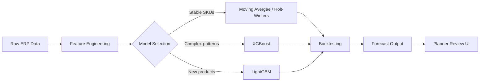
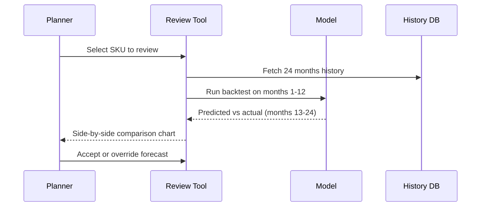

This is a writeup of the forecasting pipeline I built at BD. Not the polished
conference-talk version — the actual messy parts that took the most time to figure out.

## The problem

We had 50,000+ SKUs across multiple regions, each needing a monthly forecast.
The old process: planners doing it manually in Excel. The new goal: ML models
that planners actually trust and use.

Getting to 93% adoption rate wasn't about model accuracy alone.

## Architecture overview

Here's how the pipeline fits together. You can write these diagrams directly
in markdown using triple backtick + `mermaid`:



The key insight: not every SKU needs the same model. Routing them based on
historical variance and seasonality strength saved a lot of headaches.

## Feature engineering

The features that actually moved the needle:

| Feature            | Type          | Why it helped             |
| ------------------ | ------------- | ------------------------- | ----------------- | --- |
| Lag 1, 3, 6 months | Numeric       | Recent trend signal       |
| Month of year      | Categorical   | Seasonality               |
| Days in month      | Numeric       | Normalises volume         |
| <!--               | Price changes | Numeric                   | Demand elasticity | --> |
| Backorder flag     | Binary        | Supply-side noise removal |

```python
def build_features(df: pd.DataFrame) -> pd.DataFrame:
    # Lag features — the most predictive ones by a wide margin
    for lag in [1, 3, 6, 12]:
        df[f"lag_{lag}"] = df.groupby("sku_id")["demand"].shift(lag)

    # Rolling statistics capture trend without leaking future data
    df["rolling_mean_3"] = (
        df.groupby("sku_id")["demand"]
        .transform(lambda x: x.shift(1).rolling(3).mean())
    )

    # Month encoding — sine/cosine beats one-hot for cyclical features
    df["month_sin"] = np.sin(2 * np.pi * df["month"] / 12)
    df["month_cos"] = np.cos(2 * np.pi * df["month"] / 12)

    return df
```

## The backtesting framework

This is the part that built planner trust. Instead of just showing accuracy
metrics, we let planners see how the model would have done on their own SKUs
over the past 12 months.



When planners can see the model beating their manual forecast on last year's data,
adoption happens naturally. We didn't have to sell it — the numbers did.

## Results

After 6 months in production:

- **5% improvement** in weighted MAPE vs baseline
- **93% of forecasts** accepted without manual override
- **~200 planner-hours/month** saved on routine SKUs

The remaining 7% overrides are actually healthy — they capture things the model
can't see, like a sales team running a promotion or a new hospital contract.

## What I'd do differently

<!-- Ship a simpler model faster. We spent two months tuning XGBoost before realising
that for 60% of SKUs, a simple 12-month rolling average was within 2% of the
ML model's accuracy. Start simple, add complexity where it earns its keep. -->
