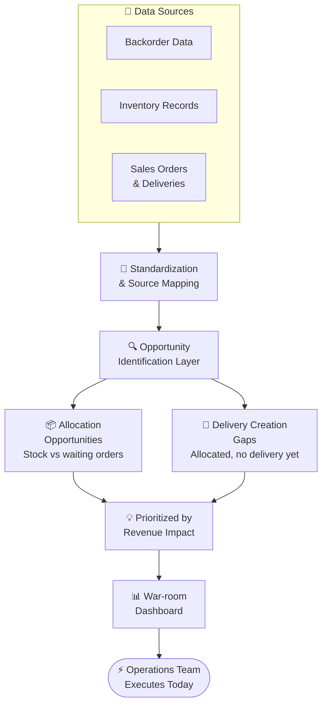

## The problem

Knowing you have backorders is one thing. Knowing *what you can actually do about them today* is different.

Inventory sits at a site without a delivery against it. Open backorders could be partially filled if someone looked at the allocation picture properly. Orders are confirmed and allocated but nobody has created the delivery document. The information to fix all of this exists — it's just scattered across order tables, inventory records, and delivery data that nobody is looking at together.

This tool pulls it into one place and tells execution teams exactly where they can act.

## What it does

### Backorder visibility

Tracks both supply backorders (no inventory available) and distribution backorders (inventory exists but isn't reaching the customer). The distinction matters — the required action is completely different for each.

### Allocation opportunity identification

For each SKU-Site, the tool checks whether inventory is available and whether there are open orders waiting for it. If stock is sitting unallocated against demand that already exists, that's a gap that can be closed today.

### Delivery creation gaps

Orders that are confirmed and allocated but don't yet have an outbound delivery document. These are the fastest wins: no supply constraint, no allocation issue — just an execution step that hasn't happened yet. Catching these before the day's cutoff directly moves revenue.

## Data flow

## Who uses it

Daily execution and operations teams — the people responsible for converting open backlog into shipments each day. The output isn't for analysis; it's for action. Every row has a clear next step attached to it.

## Impact

- Distribution backorders reduced through faster inventory-to-order matching
- Delivery creation gaps caught before end-of-day cutoffs
- Revenue realization accelerated by removing execution bottlenecks
- Reduced manual coordination between planning, warehouse, and logistics teams
