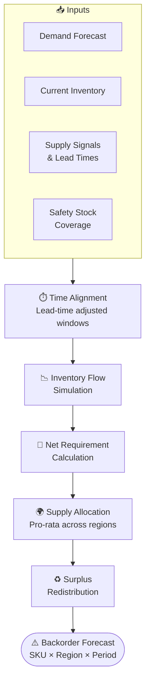

## The core idea

A backorder happens when demand outpaces supply. That sounds simple, but predicting *when* and *where* it happens requires simulating how inventory actually moves over time — factoring in lead times, demand variability, safety buffers, and incoming supply from multiple sources.

The fundamental equation:

```
Backorder = Demand − (Available Inventory + Incoming Supply + Allocated Supply + Safety Buffer)
```

BOP doesn't compute this as a static snapshot. It simulates how each of those variables evolves across future time periods, so planners know not just *if* a shortage is coming, but *when* and *how large*.

## Key inputs

**Demand forecast** — Multi-period projections used to estimate future consumption and sizing requirements.

**Current inventory** — Available stock at region level, per SKU.

**Incoming supply** — All sources: production outputs, work-in-progress, in-transit shipments, open purchase orders. Only supply arriving within the relevant window is counted.

**Lead times** — Total lead time from production to region, plus availability lead time (when stock actually becomes usable). These align supply and demand correctly across time periods.

**Safety stock** — Defined in coverage days, converted to quantity using forecast demand. Acts as a buffer against uncertainty.

**Global supply pool** — Centrally available supply that can be distributed across regions based on need.

## The simulation logic

### 1. Inventory projection

For each future period, the model computes:

```
Projected Inventory =
    Current Inventory
  + Incoming Supply (lead-time adjusted)
  + Delayed Supply
  − Adjusted Demand (prorated for time remaining in period)
  − Existing Backorders
```

Demand adjustment based on time remaining makes the model responsive to real-time updates — if you're halfway through the month, you only count half the monthly demand.

### 2. Net requirement calculation

For each SKU and region:

```
Net Requirement =
    Future Demand (lead-time aligned)
  − Available Inventory (lead-time aligned)
  + Safety Stock
```

Negative results reset to zero — you can't have a negative shortage.

### 3. Supply allocation across regions

Central supply is distributed in two steps:

**Proportional allocation:**
```
Region Share    = Region Demand / Total Demand
Allocated Supply = Region Share × Global Supply
```

**Capping:**
```
Allocated Supply ≤ Region Requirement
```
No region gets more than it needs, which leaves supply available for regions that actually need it.

### 4. Surplus redistribution

When total available supply exceeds total requirement:
```
Surplus = Total Supply − Total Requirement
```
The surplus redistributes based on future demand proportions, not current demand — this avoids over-allocating to regions that will need less and under-allocating to those that will need more.

### 5. Backorder estimation

```
Backorder = Demand − (Inventory + Incoming Supply + Allocated Supply)
```

Output is at SKU × Region × Time granularity.

## End-to-end flow



## What planners do with it

BOP gives planners a concrete, time-phased picture of where inventory will run short. They can intervene — pull forward supply, redirect stock, escalate with procurement — before the backorder materializes. Reacting after the fact costs more and takes longer. BOP is the tool for acting before the fact.
