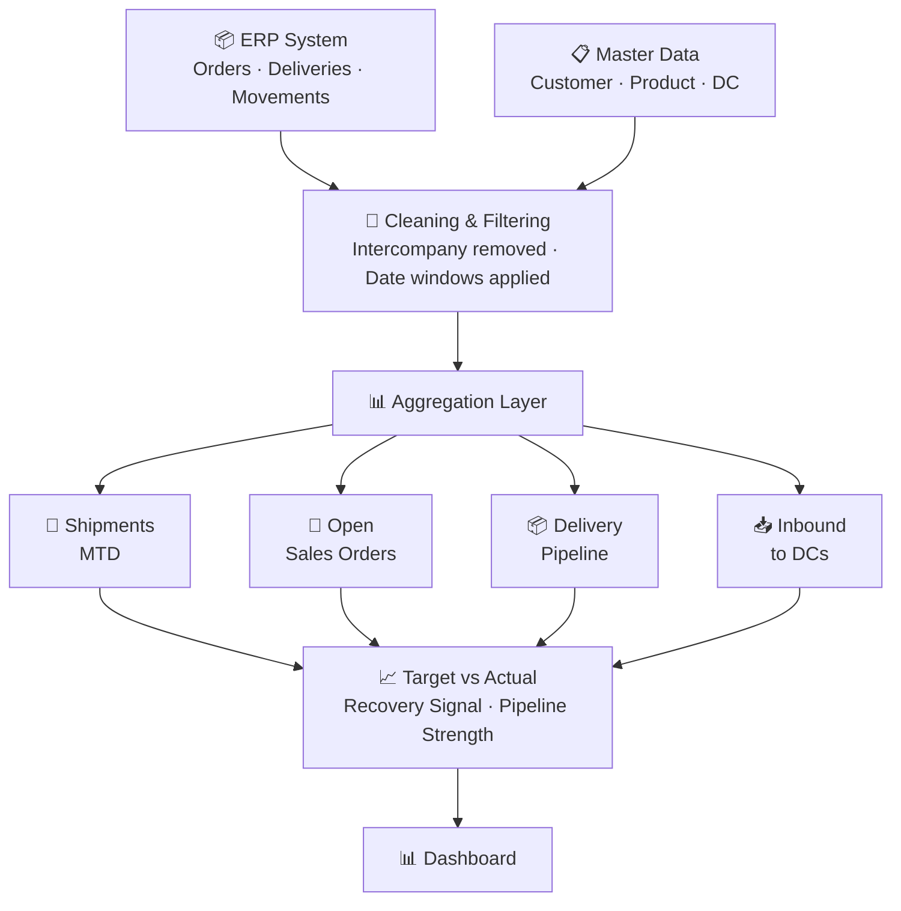

## The question this answers

> *"Will we be able to meet our outbound shipment targets this month?"*

Simple question. Surprisingly hard to answer when shipments, open orders, delivery pipeline, and inbound inventory all live in different systems and are typically analyzed by different teams.

This report connects all four into one view, so the answer is available in seconds rather than after a multi-system data pull.

## The four pieces

### Shipments (MTD)

What has actually left the warehouse from the start of month to today. Sourced from ERP material movement data, filtered to customer deliveries only — intercompany transfers and non-target geographies are excluded.

**Key metric:** Shipment units month-to-date.

### Delivery in progress

Orders where a delivery has been created but the physical shipment hasn't completed yet. This is the near-term pipeline — orders that will almost certainly convert to shipments within days.

The filter logic: delivery exists, shipment date is blank, intercompany excluded.

**Key insight:** This is the most reliable indicator of short-term shipment recovery.

### Open sales orders

Remaining demand that hasn't been picked up into a delivery yet. Filtered to active orders within the current reporting window — based on revised availability date and GI date.

**Key metric:** Open units still to be fulfilled before month-end.

### Inbound inventory to DCs

Goods received into distribution centers during the current month. Sourced from material movement data, filtered to goods receipt movement types for specific DC locations.

**Key metric:** Units received MTD — feeds into supply availability for open orders.

## How to read it

The report is designed around a simple comparison:

```
Target Outbound
vs Shipment MTD + Delivery Pipeline + Open Orders
```

If shipment MTD is low but delivery pipeline is high, recovery is likely — the units are in the system and moving. If both are low and open orders are also thin, the month is at genuine risk.

Inbound supply context sits alongside this to explain whether the issue is demand-side or supply-side.

## Data flow



## Why it matters

Shipments, open orders, deliveries, and inbound supply are usually looked at separately — by different people, in different reports, at different times. The delay in connecting them means that by the time someone spots a problem, the window to fix it has often closed.

This report was built to close that gap. Everything in one place, filtered consistently, updated on the same cadence.
