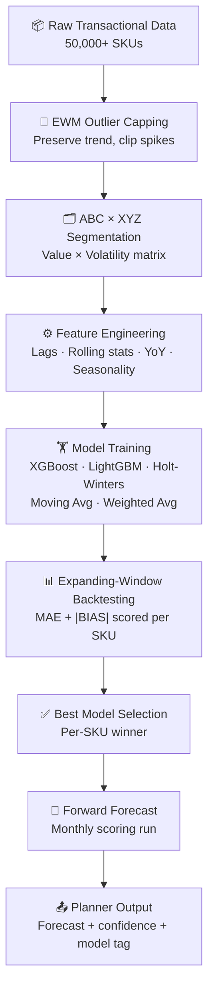

## What it does

Monthly training and scoring across 50,000+ time-series. Each SKU gets the model that actually performs best on its own history — not a single global model applied uniformly. The system runs end-to-end: clean the data, segment by behaviour, train candidates, select by backtest, score forward, deliver to planners.

## Pipeline

## Key design decisions

**Outlier handling with EWM** — Simple clipping destroys trend. Exponentially weighted mean and std preserve the shape of the series while clipping extreme spikes that would otherwise bias model training.

**ABC×XYZ segmentation** — A×X SKUs (high-value, stable demand) behave completely differently from C×Z SKUs (low-value, erratic). Segmenting before training means each cluster gets appropriate model candidates and scoring weights rather than a one-size-fits-all approach.

**Expanding-window backtesting** — Rolling window backtests leak future data. Expanding window trains on everything up to month T and scores month T+1, stepping forward. Each SKU's historical error is computed on genuinely unseen data.

**Per-SKU model selection** — Five candidate models compete on each time-series. The winner is whichever minimises `MAE + |BIAS|` across the backtest window. A single global champion would lose on the long tail.

**Data leakage guard** — All lag and rolling features are shifted by 1 period before training. Without this, the model sees the target value it's supposed to predict embedded in its own features.

## Impact

- 5% improvement in forecast accuracy vs prior baseline
- 93% planner adoption rate of AI-ML generated forecasts
- 100+ demand planners trained and onboarded
- Replaced fully manual Excel-based forecasting process
- Monthly pipeline handles full 50,000+ SKU catalogue end-to-end
