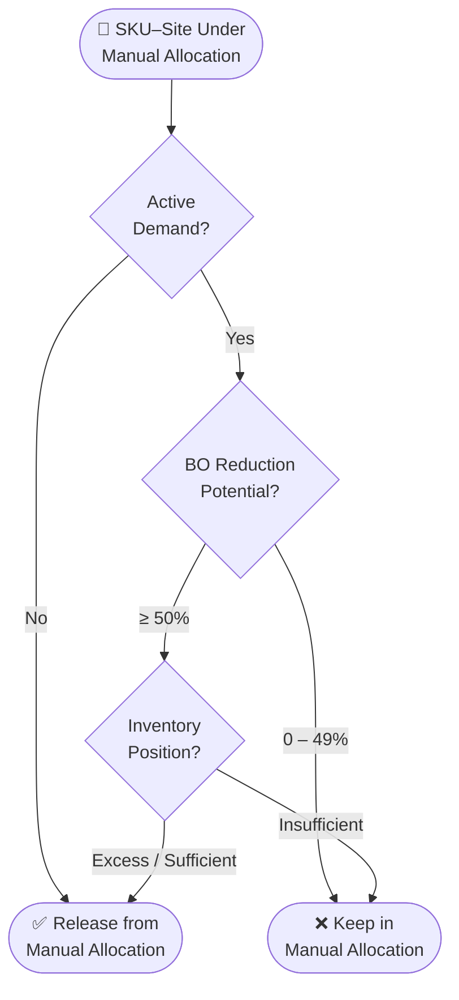
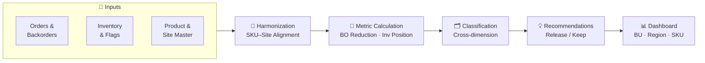

## The problem

Manual allocation puts a human in the loop for every order on a given SKU-Site. It's a control mechanism — useful when supply is constrained — but it creates operational overhead and slows down fulfillment. The problem is that once manual allocation is switched on, it tends to stay on long after the conditions that justified it have changed.

MAVA answers the question nobody was systematically asking: *which of these controls can we safely turn off?*

## How it evaluates

The tool assesses each SKU-Site across two dimensions simultaneously.

### Backorder reduction potential

If manual allocation is relaxed on this SKU-Site, how much of the current backorder gets resolved?

| Category | Meaning |
|----------|---------|
| 100% reduction | Releasing allocation clears the entire backorder |
| > 50% reduction | Significant improvement |
| 1–49% reduction | Partial impact |
| 0% reduction | No benefit — allocation isn't the constraint |

### Inventory position

Does the supply actually support releasing the control?

| Position | Meaning |
|----------|---------|
| Excess | More supply than demand — room to release |
| Sufficient | Balanced — releasing is safe |
| Insufficient | Supply shortage — releasing won't help and could hurt |
| No demand | Nothing to fulfill — control is moot |

## The decision framework

Both dimensions together determine the recommendation:

| Inventory Status | BO Reduction | Recommendation |
|-----------------|-------------|----------------|
| Excess / Sufficient | ≥ 50% or 100% | ✅ Release from Manual Allocation |
| No Demand | Any | ✅ Release from Manual Allocation |
| Insufficient | Any | ❌ Keep in Manual Allocation |
| Excess / Sufficient | 0–49% | ❌ Keep in Manual Allocation |

The logic: if releasing the control would materially reduce backorders *and* supply can support it, the control is adding friction without adding value. If supply is insufficient, releasing won't help regardless of reduction potential — the constraint isn't the allocation flag.

## Data flow

## Impact

- Operational overhead of manual allocation reduced by systematically identifying controls that no longer serve a purpose
- Inventory flow through the system improved for released SKU-Sites
- Fulfillment speed increased where allocation was the only bottleneck
- Service levels maintained — the tool only recommends release where supply confirms it's safe
