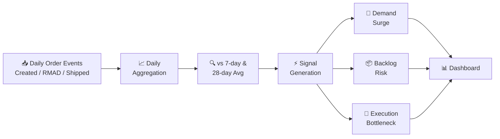
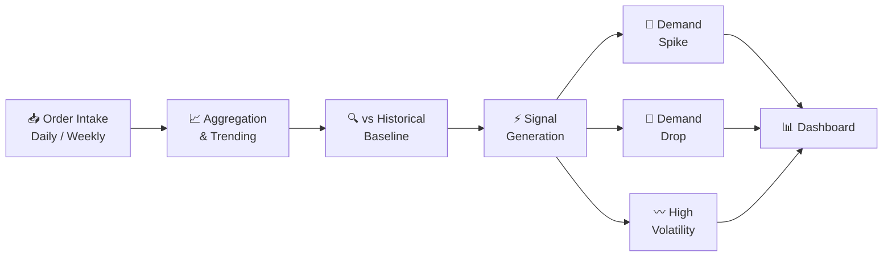

## The problem with forecasts

Forecasts are inherently backward-looking. They're built on historical patterns and take time to update. When demand suddenly shifts — orders surge, shipments stall, backlog builds — the forecast doesn't know yet. Planning teams find out when it's too late to react, often only when a KPI like OTIF or backlog already shows the damage.

The question teams were actually asking wasn't "what does the model predict?" It was: **"Is what's happening today normal?"**

## What this does

Order Sensing tracks the daily lifecycle events of sales orders — orders **created** today, orders that hit **RMAD** (Revised Material Availability Date) today, and orders **shipped** today — as daily transaction signals.

Instead of following one order from start to finish, it looks at what happened across _all_ orders on a given day, and compares that day's value against its 7-day and 28-day moving averages. Those moving averages represent the normal pattern. When today's value moves away from them, it signals a potential change in demand behavior — while it's still forming, not after it's already shown up in the numbers.

The three signals it generates:

- **Demand surge** — a sudden spike in orders created
- **Backlog risk** — RMAD volume increasing faster than shipments
- **Execution bottleneck** — shipments dropping while orders remain stable
  These signals typically show up days or weeks earlier than traditional KPIs like OTIF or backlog.

## How it works



## How the business uses it

Order Sensing doesn't replace existing reports — it complements them by answering:

- "Is today normal?"
- "Are we seeing an early demand shift?"
- "Do we need to investigate a specific BU, PHL3, region, or SKU?"
  Once a signal is detected, teams can drill into raw order data, identify the drivers (products, regions, customers), and take early corrective action.

## What it's not

Order Sensing isn't a replacement for the statistical forecast. It doesn't produce a number you can put into a planning system. It's a signal layer — an early warning that something has changed, so the right people can decide what to do about it.

## Impact

- Demand shifts visible days or weeks before traditional KPIs like OTIF or backlog react
- Planners get ahead of short-term supply adjustments instead of chasing them
- Reduces the lag between real demand movement and planning response

<!-- ---
layout: project
title: "Order Sensing Dashboard"
description: "Short-term demand intelligence tool that detects real shifts in customer ordering behavior before they show up in the forecast — catching spikes, drops, and volatility as they happen."
tech_stack: "Python, SQL, Power BI, DAX"
featured: true
order: 7
---

## The problem with forecasts

Forecasts are inherently backward-looking. They're built on historical patterns and take time to update. When demand suddenly spikes or drops — a customer pulls forward a large order, a region goes quiet — the forecast doesn't know yet. Planning teams find out when it's too late to react.

The question teams were actually asking wasn't "what does the model predict?" It was: **"What is happening to demand right now?"**

## What this does

Order Sensing is a short-term analytics layer that watches actual order intake — not statistical projections — and flags when something is moving outside of normal range.

It tracks order intake trends and customer ordering patterns at SKU level, then compares recent behavior against a historical baseline. When the gap is significant enough, it surfaces it.

The three signals it generates:
- **Demand spikes** — intake running well above baseline
- **Demand drops** — intake falling below expected range
- **Volatility** — irregular, hard-to-plan ordering patterns

These signals give planners a head start — something to act on before the forecast model catches up.

## How it works



## What it's not

Order Sensing isn't a replacement for the statistical forecast. It doesn't produce a number you can put into a planning system. It's a signal layer — an early warning that something has changed, so the right people can decide what to do about it.

## Impact

- Demand shifts visible days or weeks before forecast models react
- Planners get ahead of short-term supply adjustments instead of chasing them
- Reduces the lag between real demand movement and planning response -->
```
