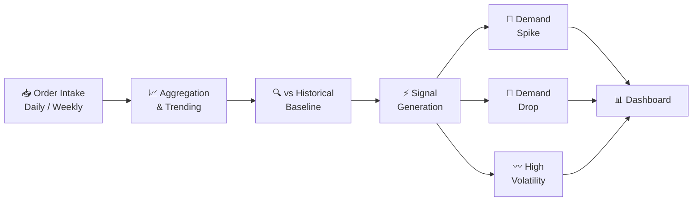

## The problem with forecasts

Forecasts are inherently backward-looking. They're built on historical patterns and take time to update. When demand suddenly spikes or drops — a customer pulls forward a large order, a region goes quiet — the forecast doesn't know yet. Planning teams find out when it's too late to react.

The question teams were actually asking wasn't "what does the model predict?" It was: **"What is happening to demand right now?"**

## What this does

Order Sensing is a short-term analytics layer that watches actual order intake — not statistical projections — and flags when something is moving outside of normal range.

It tracks order intake trends and customer ordering patterns at SKU level, then compares recent behavior against a historical baseline. When the gap is significant enough, it surfaces it.

The three signals it generates:
- **Demand spikes** — intake running well above baseline
- **Demand drops** — intake falling below expected range
- **Volatility** — irregular, hard-to-plan ordering patterns

These signals give planners a head start — something to act on before the forecast model catches up.

## How it works

## What it's not

Order Sensing isn't a replacement for the statistical forecast. It doesn't produce a number you can put into a planning system. It's a signal layer — an early warning that something has changed, so the right people can decide what to do about it.

## Impact

- Demand shifts visible days or weeks before forecast models react
- Planners get ahead of short-term supply adjustments instead of chasing them
- Reduces the lag between real demand movement and planning response
