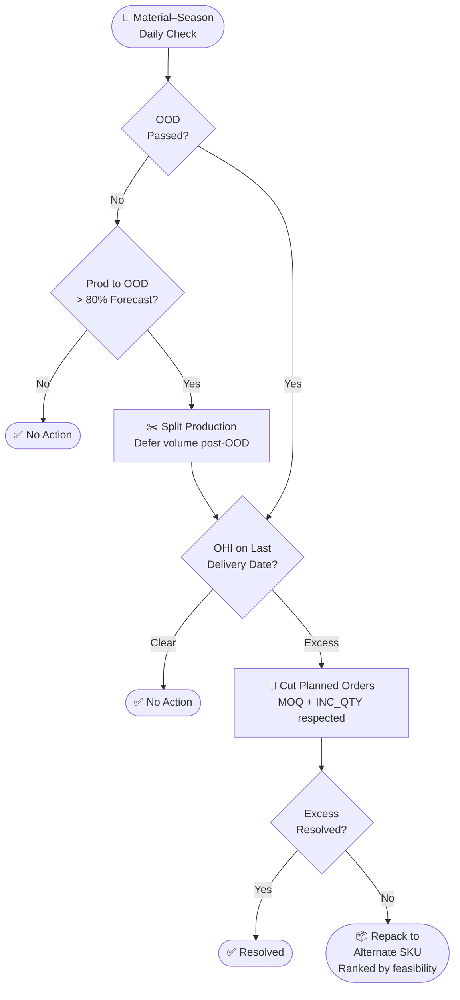

## The problem

Seasonal products have a hard cutoff. After the Last Delivery Date — October for Halloween, December for Holiday — whatever's left in the warehouse loses most of its value. Recovery runs at 20–30% at best, so by that point the damage is already done.

The difficulty isn't the math. It's the scale. With hundreds of seasonal SKUs across multiple manufacturing plants and four seasonal events running simultaneously, planners can't manually track every material-season combination every day. Weekly reviews catch problems, but by the time overproduction shows up in a planning meeting, the intervention window has usually already closed.

This system runs that daily check automatically and decides what to do about it.

## How it works

Every day, the system evaluates each seasonal material-season pair. If it finds the production plan heading toward end-of-season excess, it picks the least disruptive intervention that clears it — working through three options in sequence, stopping as soon as the excess is resolved.

### Production Split

If total planned production up to the Optimal Order Date already exceeds 80% of the seasonal forecast, the system defers some of that volume to later in the season. Don't lock in production before you know what demand actually looks like. Orders get shifted to a post-OOD week with available line capacity — the material still gets made, just not before you know you need it.

### Production Cut

If splitting doesn't resolve it — or the Optimal Order Date has already passed and inventory is still projected on the Last Delivery Date — planned orders get cut.

This part has real constraints. You can't just cancel any order. Each cut has to leave the remaining quantity at a valid `MOQ + N × INC_QTY` level, and projected on-hand inventory can't go negative in any future week as a result. The algorithm simulates the full forward inventory position before committing each cut, and sizes the reduction back if it would cause a downstream stockout.

Priority order: overloaded capacity weeks first (clears excess and relieves the line simultaneously), external plants before internal, latest production dates before earlier ones.

### Repack

If excess remains after cuts — and it clears a minimum value threshold — the system finds alternate SKUs on the same production line that can absorb what's left. Repack candidates are ranked by how close the alternate material's planned orders are to the excess week, whether they share the same BOM component group, and how tight their coverage is. The best option surfaces as a recommendation for the planner to review and act on.

## Decision logic

## How it was built

The production cut engine is a stateful Python algorithm. It processes planned orders one by one in priority order, simulates the inventory impact of each cut, checks MOQ and incremental quantity compliance, and rolls back anything that creates a future shortfall. It tracks all of this across multiple future weeks — not just the cut week — which is what makes it genuinely iterative rather than a simple ranking exercise.

The data side runs across Exasol. The ETL pipeline pulls from two source systems — ERP and the supply planning tool — across master data (materials, locations, BOMs, standard prices) and transactional data (planned orders, on-hand inventory, seasonal forecasts, production constraints). Feeds into seasonal aggregations, a production tracker, forward inventory projections, and a value dashboard.

Recommendation history is stored daily using SHA1-hashed surrogate keys with a final-flag pattern, so dashboards always surface the current state of each recommendation rather than stacking every historical row.

## Impact

- 500+ seasonal SKUs checked daily — replaces manual planner monitoring across four seasonal events
- Production cut algorithm handles MOQ, incremental quantity, and multi-week inventory validation in a single pass
- Full recommendation lifecycle tracked: accept/reject/modify, age counter, expiry, writeback status
- Value dashboard attributes waste reduction at 62% of standard cost per accepted production cut recommendation
- $3–5M projected annual benefit against a $19M+ seasonal waste problem
