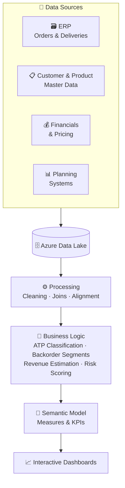

## The problem

Order data lived in three different places — ERP for transactions, planning systems for confirmations, finance for revenue. Getting any kind of complete picture meant pulling from all three, stitching it together in Excel, and hoping the numbers hadn't changed by the time you were done. Teams were spending hours on data assembly that should have taken seconds.

The bigger issue: nobody could answer "what is at risk?" without a manual deep-dive. Service failures were being caught after the fact, not before.

## What WIMO does

WIMO is a centralized analytics platform that tracks the full order lifecycle — from the moment an order is placed to goods issue — and surfaces risk before it becomes a problem.

### Order pipeline visibility

Every order moves through quantity states: Requested → Confirmed → Open → Delivered. WIMO tracks all of them in one place. You can start at business-unit level and drill straight down to a specific schedule line on a specific order. That kind of drilldown changes how planners work — instead of hunting for data, they can act on it.

### Backorder segmentation

Open demand is split into four buckets:
- Unconfirmed demand
- Confirmed but not yet delivered
- Delivery in progress (PGI pending)
- Fully shipped

Each bucket tells you what action is available. That distinction matters — unconfirmed demand needs a supply fix; delivery-in-progress just needs a truck.

### ATP reliability scoring

Not all confirmations mean the same thing. WIMO classifies every confirmation as either **Confirmed with Firm Supply** or **Confirmed without Firm Supply**, based on ATP lag and the checking horizon. This answers the question planners actually care about: *is this confirmation backed by real supply, or is the system just being optimistic?*

### Delay and service risk

The platform compares RMAD (customer-requested date) against MAD (system-confirmed availability date) and calculates delay severity, delay buckets, and OTIF risk. Service risk shows up weeks before a miss actually happens.

### Revenue landing estimation

Month-end revenue is estimated from four components:
- Revenue already posted (MTD actuals)
- Orders pending PGI that will ship this month
- Constrained pipeline — backed by firm ATP
- Unconstrained open pipeline

Run-rate projections include outlier controls to handle bulk orders that would otherwise skew the numbers.

### Self-service and drillthrough

On top of the standard views, there's flexible slicing by BU, product hierarchy, region, customer, and SKU. Analysts who need to go below the KPI surface can use the raw data drillthrough. There's also a "build your own view" mode for one-off analysis without waiting on a new report.

## Data flow

## Impact

- Single source of truth for the order pipeline — no more parallel Excel trackers
- Service and revenue risk visible weeks earlier than before
- Planners can prioritize by impact instead of spending time finding data
- Enabled proactive supply chain decisions instead of reactive ones
